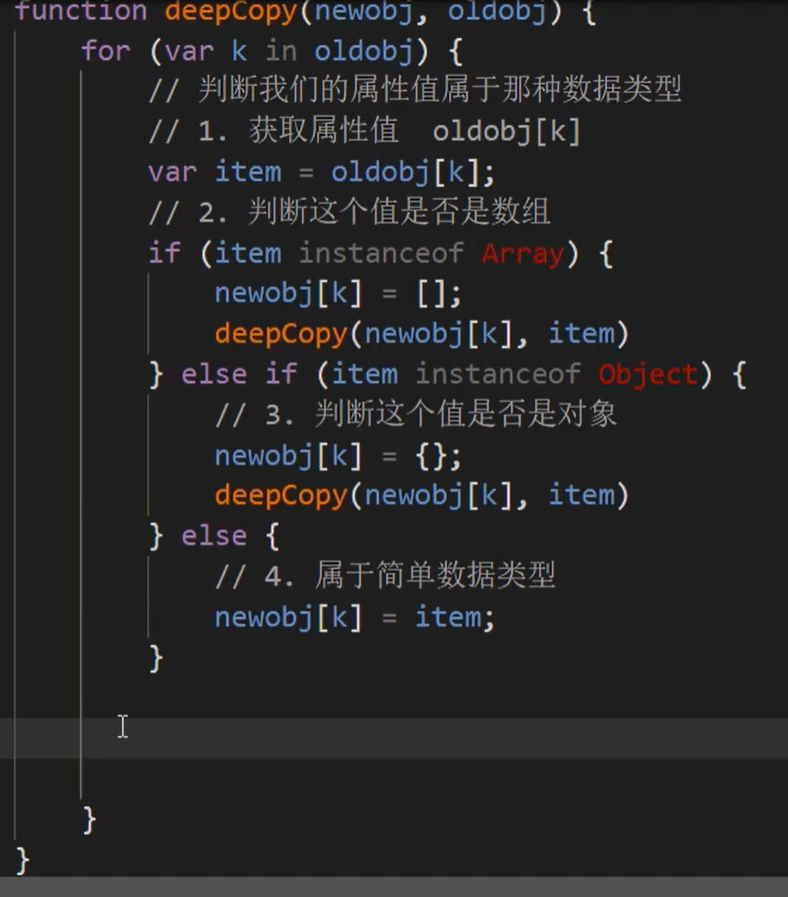

```
var obj = {
            id: 1,
            name: 'andy',
            msg: {
                age: 18
            },
            color: ['pink', 'red']
        }
        var o = {}
        // for( var k in obj){
        //     console.log(obj[k]);
        // }
        function deepcopy(newobj,oldobj){
            for( var k in oldobj){
                var item = oldobj[k]
                if (item instanceof Array) {
                    newobj[k] = []
                    deepcopy(newobj[k],item)
                } else if (item instanceof Object) {
                    newobj[k] = {}
                    deepcopy(newobj[k],item)
                } else{
                    newobj[k] = item
                }
            }
        }
        deepcopy(o,obj)
        obj.msg.age = 20
        console.log(o);
```

