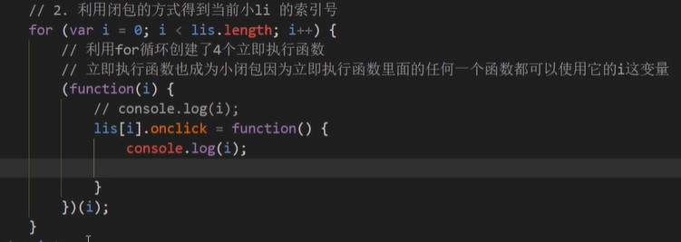

**闭包(Closure)**  指有权访问另一个函数作用域中变量的函数。

例子:

```js
function fn() {
            var num = 10
            function fun() {
                console.log(num)
            }
            fun()
        }
        fn()
```

主要作用: 

延伸了变量的作用范围

案例:



异步输出产生间隔

```
for (var i = 0; i < 5; i++) {
            (function (i) {
                setTimeout(function () {
                    console.log(i);
                }, i*1000)
            })(i)
        }
```

