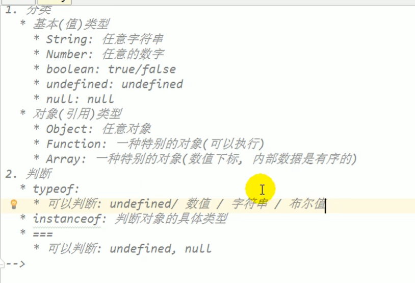
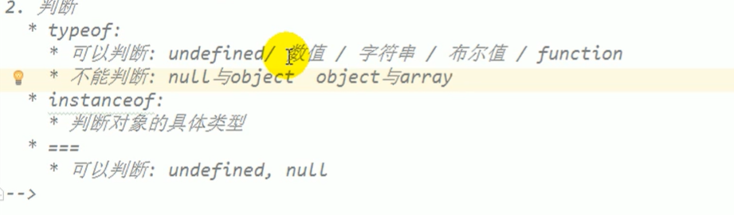

<h1>undefined和null的区别</h1>

* <span style="font-size:20px;">undefined代表定义未赋值</span>
* <span style="font-size:20px;">null定义并赋值了，只是值为null</span>


<h1>什么时候给变量赋值为null</h1>

* 初始赋值为null,表明将要赋值为对象

  ```
  var b = null 
  ```

* 结束前,让b指向的对象成为垃圾对象(被垃圾回收器回收)

  ```
  b = null
  ```

  <strong>栈:全局变量/局部变量</strong>

  <strong>堆:对象</strong>