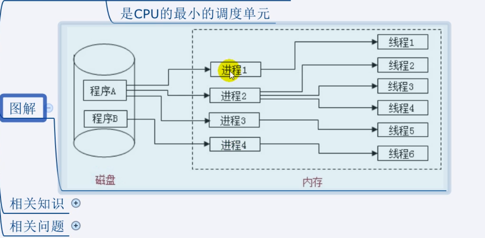

<h1>进程</h1>

程序的一次执行,他占有一片独有的内存空间

可以通过windows任务管理器查看进程

<h1>线程</h1>

是进程内的一个独立执行单元

是程序执行的一个完整流程

是CPU的最小的调度单元

* 应用程序必须运行在某个进程的某个线程上
* 一个程序中至少有一个运行的进程:主进程,进程启动后自动创建
* 一个进程中也可以同时运行多个线程,我们会说是程序是多线程运行的
* 一个进程内的数据可以供其中的多个线程直接共享
* 多个进程之间的数据是不能直接共享的
* 线程池(thread pool):保存多个线程对象的容器,实现线程对象的反复利用

<h1>何为多进程与多线程?</h1>

* 多进程运行:一个应用程序可以同时启动多个实例运行
* 多线程:在一个进程内,同时有多个线程运行

<h1>比较单线程与多线程</h1>