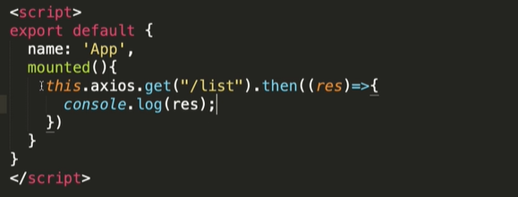
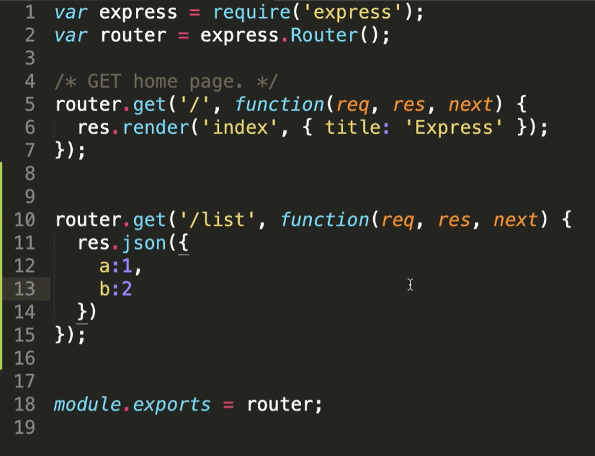

# 初始化Vue

* #### 1.初始化一个Vue-cli项目

  * 安装axios

    * ```
      cnpm install axios --save-dev
      ```

      * main.js引入
        * import axios from 'axios'; /* 引入axios进行地址访问*/
        * Vue.prototype.$http = axios;

    * 安装resource

      * cnpm install vue-resource --save-dev
        * main.js引入
        * import VueResource from 'vue-resource‘
        * Vue.use(VueResource)

  * 2.在界面的mounted中发起一个请求

  


* #### 2.配置node文件

  * 全局安装 cnpm install express-generator -g
  * 安装server文件 express --views=ejs <!--项目名称,此处采用server--> server
  * cd server进入server目录 安装依赖项 cnpm install
  * npm start启动 <!--默认端口号为 3000-->
  * server -->routes-->index.js 进行配置 如:
    * 


* #### 进行跨域处理(具体可访问https://www.jb51.net/article/167890.htm)

  * 进入vue.config.js中进行配置 如:

    ```
    module.exports = {
        devServer: {
            open: true, //是否自动弹出浏览器页面
            host: "localhost",
            port: '8081',
            https: false,
            hotOnly: false,
            proxy: {
                '/api': {
                    target: 'http://localhost:3000', //API服务器的地址
                    ws: true, //代理websockets
                    changeOrigin: true, // 虚拟的站点需要更管origin
                    pathRewrite: {  //重写路径 比如'/api/aaa/ccc'重写为'/aaa/ccc'
                        '^/api': ''
                    }
                }
            },
        }
    }
    ```

    

  * ```
    修改mounted代码为:
    	 mounted() {
        this.axios.get('api/list').then(res => {
          console.log(res)
        })
      }
    ```

    

* #### 进行数据库配置

  * 进入server文件夹安装mysql

    `cnpm install mysql`

  * server --> db-->sql.js

    * 进入这个网站查询如何连接数据库https://www.npmjs.com/package/mysql

    * 例如:

      * ```
        var mysql      = require('mysql');
        var connection = mysql.createConnection({
          host     : 'localhost',
          user     : 'root',
          password : 'phoenixyu80yy',
          database : 'tarrow'
        });
        module.exports = connection
        ```

        

    最后在server-->index.js文件配置请求 如:

    ```
    var connection = require('../db/sql.js')
    router.get('/list', function (req, res, next) {
      connection.query("select * from user", function (error, results, fields) {
        if (error) throw error;
        // console.log('The solution is: ', results);
        res.json(results)
      })
    });
    ```