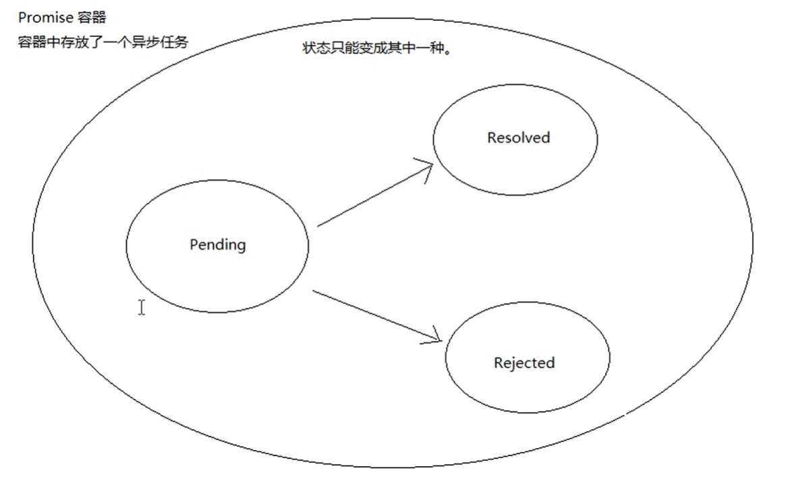
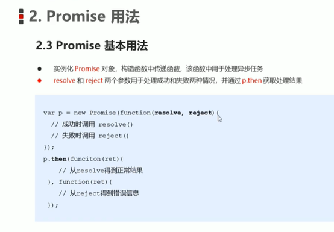
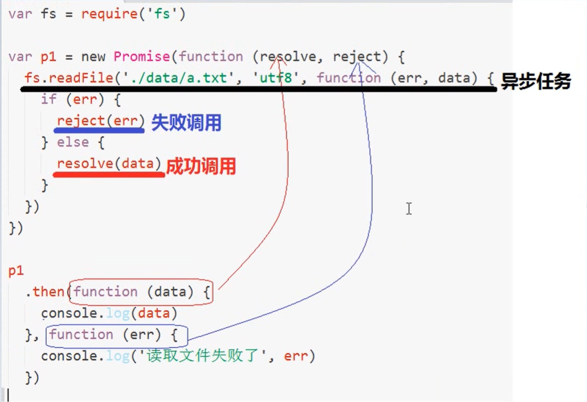
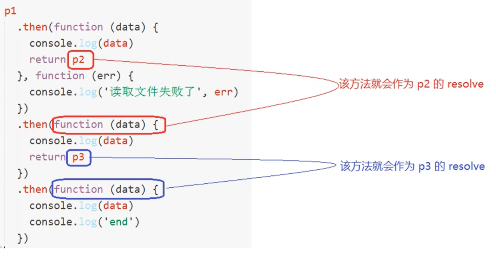

# 	Promise

<!--Es6中新增的API ---Promise-->

<!--promise是一个构造函数-->

<!--Promise本身不是异步，它内部的任务是异步-->









## 基本语法:

```js
var fs = require('fs')
var p1 = new Promise(function (resolve, reject) {
    fs.readFile('./a.js', 'utf8', function (err, data) {
        if (err) {
            // console.log(err);
            reject(err)
            // reject相当于调用了then方法的第二个参数
            // 把容器peding状态改为rejected
        }
        // console.log(data);
        // 这里调用的resolve方法实际就是then方法传递的那个function
        resolve(data)
        // 把容器peding状态改为resolved
    })
})
var p2 = new Promise(function (resolve, reject) {
    fs.readFile('./b.js', 'utf8', function (err, data) {
        if (err)
            reject(err)
        resolve(data)
    })
})
var p3 = new Promise(function (resolve, reject) {
    fs.readFile('./c.js', 'utf8', function (err, data) {
        if (err)
            reject(err)
        resolve(data)
    })
})
// then方法接受的function就是容器中的resolve函数
p1
    .then(function (data) {
        // 当p1读取成功时
        console.log(data)
        return p2
    }, function (err) {
        console.log('失败')
    })
    .then(function(data) {
        console.log(data);
        return p3
    })
    .then(function(data) {
        console.log(data)
    })
```

## 封装

```
var fs = require('fs')
function pReadFile(path) {
    return new Promise(function (resolve, reject) {
        fs.readFile(path, 'utf8', function (err, data) {
            if (err)
                reject(err)
            resolve(data)
        })
    })
}
pReadFile('./a.js')
    .then(function (data) {
        console.log(data)
        return pReadFile('./b.js')
    })
    .then(function (data) {
        console.log(data)
        return pReadFile('./c.js')
    })
    .then(function (data) {
        console.log(data)
    })
```

