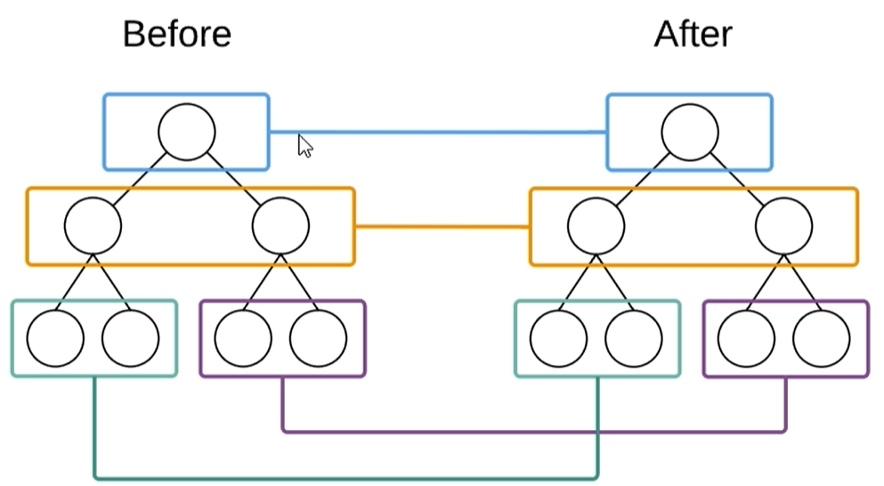

# **Diff算法**	

* **tree diff:新旧两颗DOM树，逐层对比的过程，就是Tree Diff，当整棵DOM树逐层对比完毕，则所有需要被按需更新的元素，必然能够被找到**
* **component diff:在进行Tree Diff的时候，每一层中，组件级别的对比,叫做Component Diff**
  * **如果对比前后,组件类型相同，则暂时认为此组件不需要被更新**
  * **反之，则需要移除旧组件，创建新组件,并追加到页面上**
* **element diff:在进行组件对比的时候，如果两个组件类型相同,则需要进行元素级别的对比,这叫做element diff**

