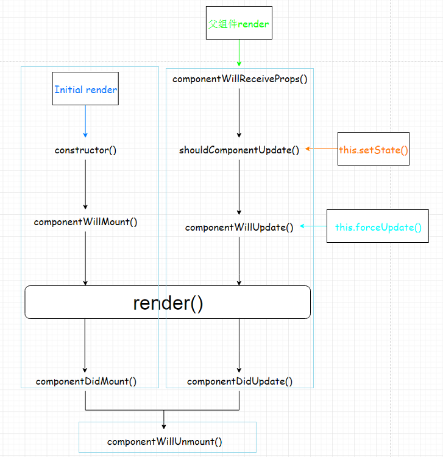
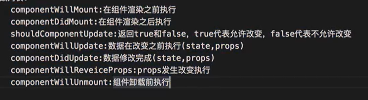

```
<!DOCTYPE html>
<html>

<head>
    <meta charset="UTF-8">
    <title>Document</title>
    <script src="../node_modules/react/umd/react.development.js"></script>
    <script src="../node_modules/react-dom/umd/react-dom.development.js"></script>
    <script src="../node_modules/prop-types/prop-types.js"></script>
    <script src="../node_modules/babel-standalone/babel.min.js"></script>
</head>

<body>
    <div id="example"></div>
    <script type="text/babel">
        /* 两个大括号的作用
            外围大括号表示内部为JS代码
            内部大括号表示JS对象
        */

        class Life extends React.Component {
            constructor(props) {
                super(props)
                this.state = {
                    opacity: 1
                }
                this.distroyComponent = this.distroyComponent.bind(this)
            }
            distroyComponent() {
                ReactDOM.unmountComponentAtNode(document.getElementById('example'))
            }
            componentDidMount() {
                console.log('启动定时器')
                this.intervalid = setInterval(function () {
                    let { opacity } = this.state
                    opacity -= 0.1
                    if (opacity <= 0) {
                        opacity = 1
                    }
                    this.setState({ opacity })
                }.bind(this), 200)
            }
            componentWillUnmount() {
                // 清理定时器
                clearInterval(this.intervalid)
            }
            render() {
                const { opacity } = this.state
                return (
                    <div>
                        <h2 style={{ opacity }}>{this.props.msg}</h2>
                        <button onClick={this.distroyComponent}>解绑</button>
                    </div>
                )
            }
        }
        ReactDOM.render(<Life msg="ff14真好玩" />, document.getElementById('example'))
    </script>
</body>

</html>
```

