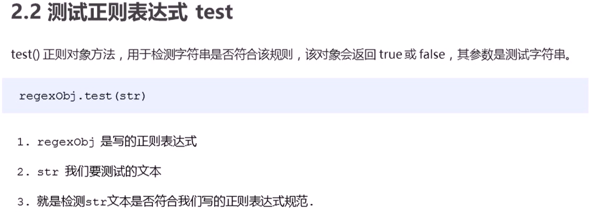
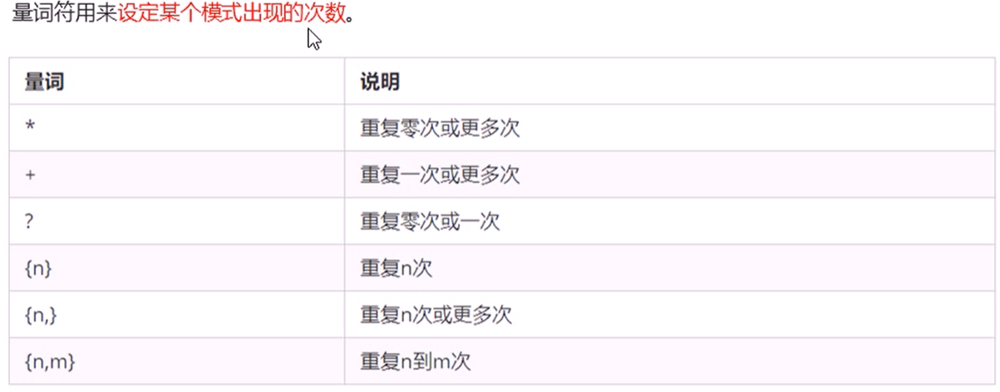
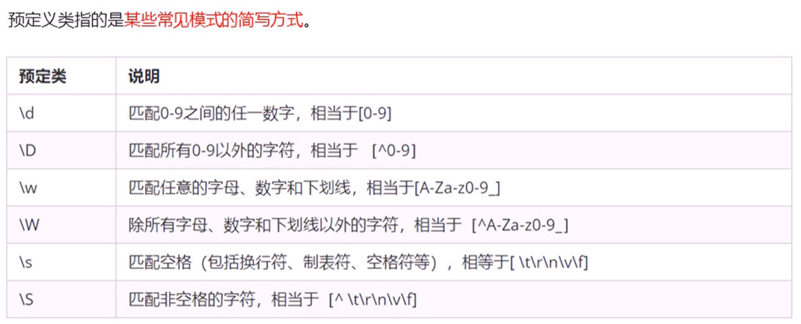

# 正则表达式里面不需要加引号，不管是数字型还是字符串型



```
var regexp = new RegExp(/123/)
        console.log(regexp);
        // 利用字面量创建 正则表达式
        var rg = /123/
        console.log(rg.test('123'));
```

* 边界符 ^ $
  * /abc/只要包含abc这个字符串返回的都是true
  * 精确匹配 /^abc$/要求必须是abc字符串才符合规范

* 字符类: []表示有一系列字符串可供选择，只要匹配其中一个就可以了
  * /[abc]/只要包含有a || b||c 都返回true
  * /^[abc]$/三选一 只有是 a || b||c这三个字母才返回true
  * /[a-z]/a到z的字符

* 字符组合

  * /[a-zA-Z0-9_-]/大写小写都支持

  * ```
    /^[^a-zA-Z0-9_-]$/方括号内的^为取反
    ```

    

* 量词符

  ​	

  * *相当于 >=0 可以出现0次或者很多次
  * +相当于 >=0 可以出现1次或者很多次
  * ?相当于 1 || 0
  * {3}重复三次
  * {3,}相当于 >=3
  * {3,16}相当于 >=3 ,<=16中间不要有空格

  

* 括号总结

  * 大括号,量词符,表示重复次数
  * 中括号字符集合,匹配方括号中的任意字符
  * 小括号表示优先级

* 预定义类
  * 